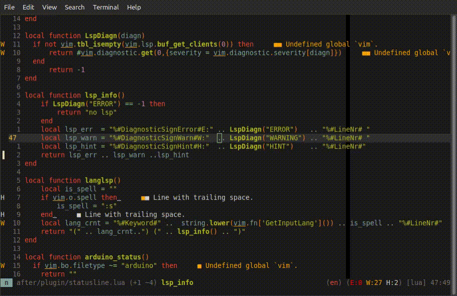
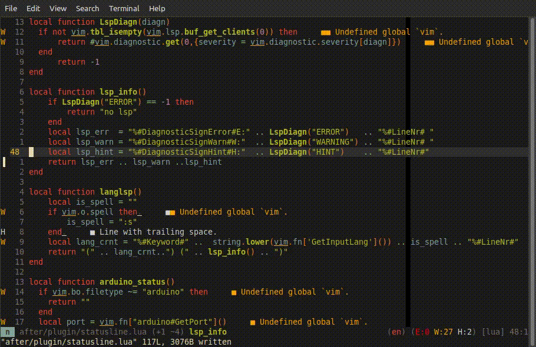
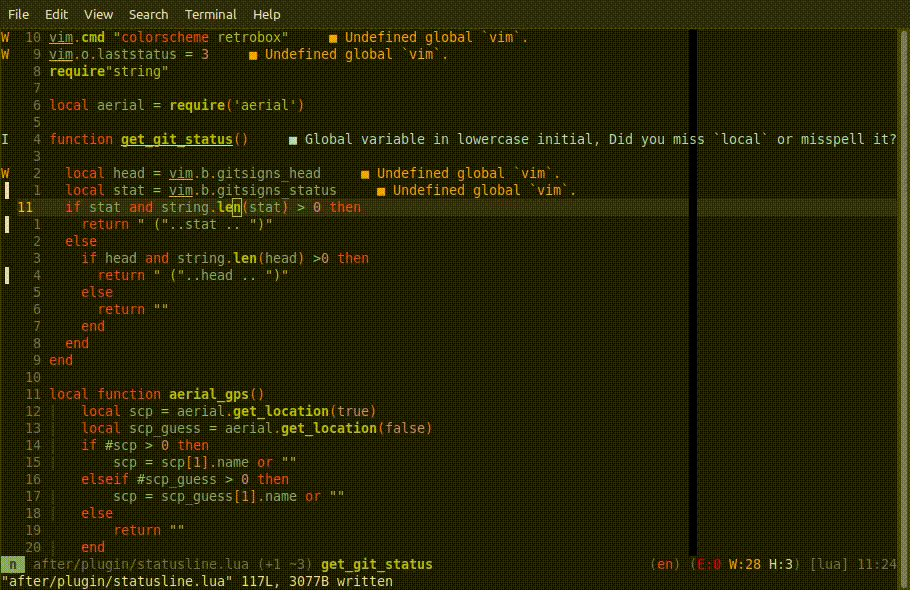
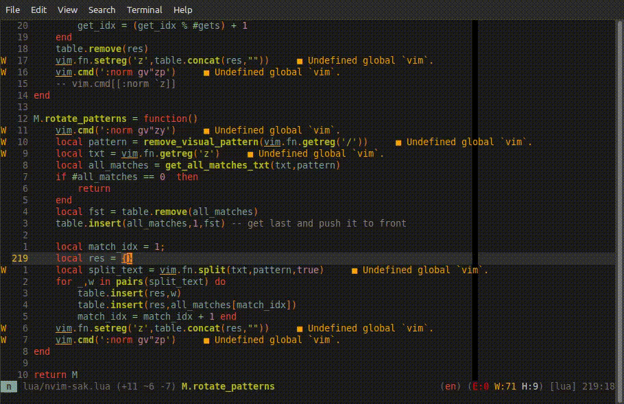

# nvim-sak

A simple-ish wrapper around sed to approximate select mode from
helix/kakoune.

I wanted something like what kakoune has for multi cursor. It's neat. Other
plugins that provide multi cursor that I have tried are either slow or are too
much mental overhead to use properly. It's not that they are bad though. This
feels vim-like to me that I don't even need to think about it.

It goes like this: ```in motion``` -> ```highlight pattern``` -> ```replace/accumulate/paste/rotate```

## How it works

This plugin is a interactive wrapper around sed, with some limitations.
Currently provides 5 functions:
``` vim
<Plug>NvimSakHihglightInMotion 
<Plug>NvimSakInteractiveReplace 
<Plug>NvimSakAccumulate
<Plug>NvimSakInterleave
<Plug>NvimSakRotate
```
Main ones being
``` vim
<Plug>NvimSakHihglightInMotion
<Plug>NvimSakInteractiveReplace
```
It's not mandatory to use them together. Their requirements are visual marks and
something in the ```/``` register. These can be set otherwise, but they work
nicely together. Selection can also be adjusted.

While it would probably just be easier just to make a mapping like ```
:'<,'>s/input()/input()/g``` and it would get you most of the way there, it's not as nicely
behaved. For example ```'<``` takes the **line** of the mark, and in partial
line visual selection, whatever you do may have unwanted effects. ``` `< ``` is
the mark that has has both **line and column**, but doesn't really work with sed,
for some reason.

 - <Plug>NvimSakHihglightInMotion

    Requires a motion after(ex: ```sip``` , ```sas```). Creates a prompt with
    some completions I have decided are common. Text that matches that pattern,
    gets highlighted as you write. The search is ```.``` repeatable, the last
    contents of the ```/``` register are included with ```\<``` and ```\>```
    around it. A single tab would just add a ```\w\+``` to the pattern. On enter
    the pattern is put into the register and will highlight whatever matches it
    in the current visual selection(which would be the endings of the motion.
    ex: ```i"```,```ib```, ```a{``` ).

   This doesn't really play nice with ```ignorecase``` and ```smartcase```.  But
   If it's on or off he the option gets added to the completion list.

 - <Plug>NvimSakInteractiveReplace
   
   It provides a prompt with a default value of '\0'. That would leave the text
   unchanged. Delete it and t will delete all occurrences of whatever is in the
   search register from whatever is surrounded by the visual marks. It functions
   like a sed command. It is also updates the text while writing. On enter
   confirms the operation. On ```<Esc>``` it cancels the operation. 

   If you delete the '\0' and instead the pattern starts with ```@``` it will be
   interpreted as a ```:'<'>g/{pattern}/:norm {your_input_here}``` this is useful.

   While this is arbitrary, It's better than having 2 different commands,
   though I might change my mind on that.

 - <Plug>NvimSakAccumulate
   
   Works with the same assumptions as ```NivmSakInteractiveReplace``` - visually selected
   place and pattern in ```/```. It collects every occurrence of the pattern in the
   ```+``` register, each on a new line.

 - <Plug>NvimSakInterleave
   
   Works with the same assumptions as ```NvimSakInteractiveReplace``` - visually
   selected place and pattern in ```/```. It is the inverse (kind of) of
   ```NvimSakAccumulate```. For every occurrence of pattern in the visual
   selection it a line from the ```+``` register. If the lines end, it goes
   through them again until all matches are exhausted. With one it would replace
   all of them with that one. With one line in the ```+``` register it's just
   replace paste, with more it can be quite useful. Ex: take all the patterns
   from a selection edit them on the side, then return them to their places with
   ```NvimSakInterleave```.

 - <Plug>NvimSakRotate
   
   Works with the same assumptions as ```NvimSakInteractiveReplace``` - visually selected
   place and pattern in /. Rotates the order of each pattern in a visual selection.
   Ex: (this, other,else) -> (else, this,other), or just general chaos.

- Tbd
  
  There are some other useful ones, that I haven't had the time to implement or
  haven't thought or even had the need for.


## Demo
 - NvimSakHihglightInMotion + NvimSakInteractiveReplace 

 - NvimSakAccumulate + NvimSakInterleave 

 - NvimSakRotate pt1

 - NvimSakRotate pt2


## Some caveats
While achieving my goals for editing they are still powered by sed, so all of
its limitations follow, and how it behaves could depend on your configuration.

Also it is inefficient in it's implementation, the indented use case is small
files and small changes. Otherwise I think it will cause too many updates. Still
haven't had any problems. For anything big, better straight use sed. This thing
is kind of for the middle ground. Edit too little worth a sed but too big to be
one edit.

By default it uses mark `z` and register `z` during normal operation.

## Some of my example uses
### NvimSakHihglightInMotion
- highlight ls the occurrences of a pattern in a textobject, and also jump
  between them afterwards. This can be function, block, sentence, end of the line, etc.

### NvimSakAccumulate
- This collects all the matches in the selection and puts them separated by a
  new line in the '+' register
- Not as useful if using just a plain text pattern, but if using a regex is
  quite useful

### NvimSakInteractiveReplace
- Split a line on a certain symbol/s. This is kinda tricky to do with sed
  sometimes, especially if on the same line and with visual mode patterns.
- Add/remove/prepend/append to pattern.
- Refactoring a variable.
- Execute a :g norm command on lines with the match. - If the replace pattern
  begins with @, it will be interpreted as the arguments to a :g norm command

## Setup
There isn't much for setup. Install with plugin manager of choice. Therre isn't any setup, it should get sourced at startup.

``` vim
Plug 'rdpopov/nvim-sak'
```

And these are the keymaps I use.

Lua:

``` lua
local keymap = vim.api.nvim_set_keymap
keymap('n','s', '<Plug>NvimSakHihglightInMotion',{noremap = true, silent = true, desc="Highlight in current motion"})
keymap('n','<Leader>r', '<Plug>NvimSakInteractiveReplace',{noremap = true, silent = true, desc="Replace in visuial selection"})
keymap('n','<Leader>c', '<Plug>NvimSakAccumulate',{noremap = true, desc="Accumilate strings matching the pattern in visal selection"})
keymap('n','<Leader>i', '<Plug>NvimSakInterleave',{noremap = true, desc="Repace pattern in selection with strings from + registe"})
keymap('n','<Leader>s', '<Plug>NvimSakRotate',{noremap = true, desc="Rotatates the places of the selected pattern in visual selection"})
```

Other useful remaps that combo very well with this plugin:

``` lua
local keymap = vim.api.nvim_set_keymap
keymap('n',',/', ':nohlsearch<CR>',{noremap = true, silent = true ,desc="Turn temporarily searching highlight off"})
keymap('x','<leader><leader>', ":normal ",{noremap = true, desc="Execute normal mode command over visual selecetion"})
keymap('n','Q', '@q',{noremap = true, silent = true,desc = "Shorthand for executing register q"})
```
